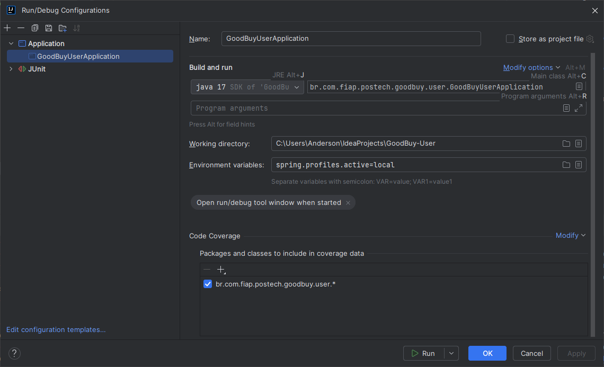

# GoodBuy-User

microserviço de usuario do sistema GoodBuy

Para rodar o serviço usando docker compose execute os seguintes comandos:
 - docker network create goodbuy-network
   - pode já existir caso outro microserviço tenha sido iniciado antes deste.
 - docker compose up

Para rodar localmente -e necessario informar o parametro spring.profiles.active=local, conforme abaixo:
